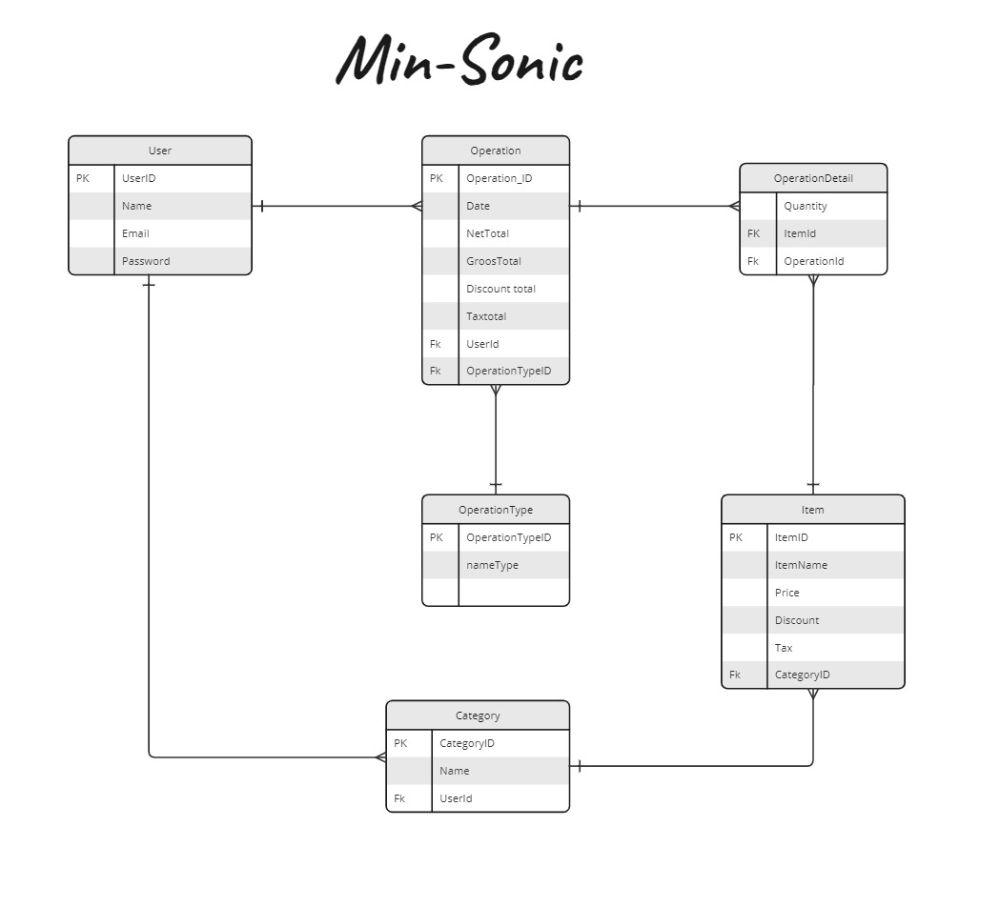

## Sonic Mini
-This is backend Api I used  a .net API and I applied the three-tier architecture with the generic repository, Also I used dapper ORM to connect with the database.
- frontend side [Mini Sonic ]([URL](https://github.com/abdarahman-shaheen/Sonic-mini)) (I used Angular )
## ERD

## Technologies Used:
- **Frontend Framework:** Angular 
- **Backend Framework:** .NET [7.14]
- **API:** .NET Web API 
- **Database:** SQL Server 
